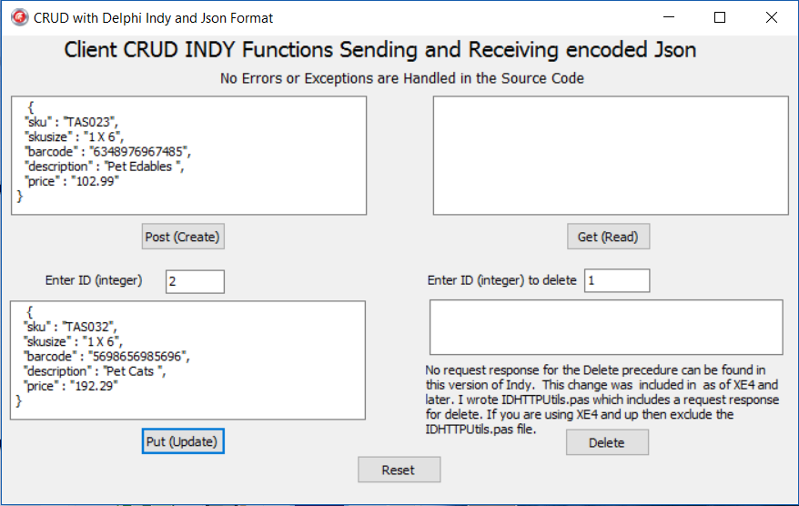
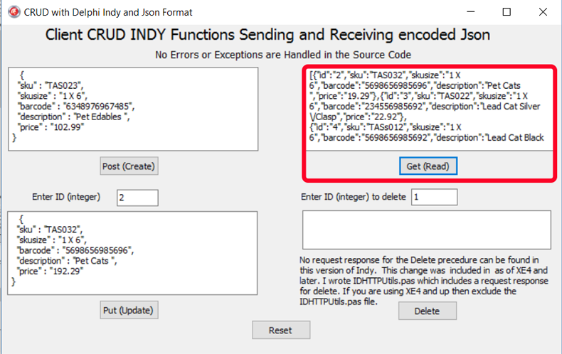
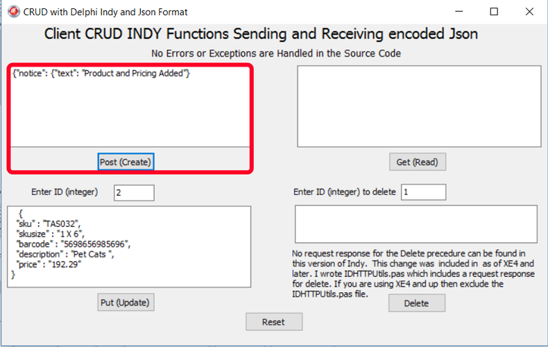
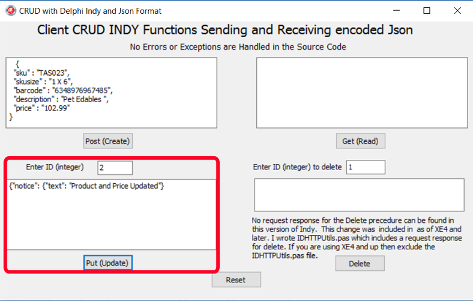
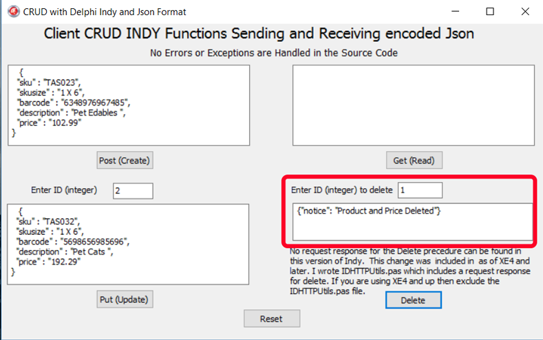

**Part 2**

**Purpose**

Build a simple client application that can handle the Post, Get, Put and Delete
calls to the Rest Server sending REST Requests and getting REST Responses using
JSON string.

**Background**

On researching the availability of Indy open source helper libraries that were
available, some were largely incomplete or featured fat-code all using XML as
part of the Request and Response language. Also I found that the Indy
documentation was largely limited. So to keep it simple and lightweight I wanted
a lightweight Client that could handle JSON.

The Indy version from XE3 and older does not include a REST Response for Delete
calls. It must be noted that as of XE4 and newer, many fixes and updates have
been undertaken and the Delete REST response code was subsequently fixed for
later Releases.

I was forced to write a simple extended library to accept a REST response for
the DELETE function.

**IDE**

This is suited for all IDE’s however Embarcadero has introduced a more modern
approach to REST in the later IDE’s including an extensive JSON library. The
Newer REST components feature built in SSL.

So if you have an older IDE then, Part2 will largely suite your requirement.

**Libraries**

Delphi Indy library, included in most Delphi IDEs.

**Code**

I will focus on the REST calls code and the extension. I will not be focusing
how to set up the front end. The screen images should speak for themselves.

I have included a source download that will save all the trouble of setting all
it up.

In PART 2 authorisations, error messages, JSON conversion and usage of JSON is
not covered. Error messages, JSON usage will be covered in PART 3.

**The GET Call**

**I**n the uses section add ‘IdHTTP, IDhttputils, IdGlobal’.

Here we do not place the component ‘TIDHttp ‘on the main form but will create
and delete it at run time for each call made.

This singular component handles the TOTAL REST process and relies on the two
libraries IDhttputils and idGlobal.

The component http: TIDHttp is declared as a variable then created as nil.

A few settings are made to make it operate.

HandleRedirects set to true.

ReadTimeout set to the default level of 5000. This adjustment can be set to take
into account:-

-   Where the server is operating from in the world,

-   The server and client bandwidth.

-   How busy the Rest Server Rest Request/Response routes are.

MaxAuthRetries is set to a default O .

Many HTTPOptions are available … ‘ **TIdHTTPOption = (hoInP**ro**cessAuth,
hoKeepOrigProtocol, hoForceEncodeParams, hoNonSSLProxyUseConnectVerb,
hoNoParseMetaHTTPEquiv, hoWaitForUnexpectedData);’.**

As the calls to the Live Server or Localhost are made without using
Authorisation then the ‘HTTPOptions - [**hoKeepOrigProtocol**]’ is used and will
not force the Server to perform unnecessary header checks before processing the
REST request.

However if Authorisation is used then the ‘HTTPOptions-
[\*\*hoInProcessAuth]’\*\* would be used.

The REST Request is set as http for normal calls. Https calls would require the
Open Source SSL DLL’s to be included with the Application.

The REST Request ‘content type’ is set as 'application/json'. Here the data that
we will send will be in the JSON format and The REST request will receive it in
this format. If you need to know more as to why we use this format, PART 1
summarises this for you.

A memo Shows visually the REST Request data and REST Response Data for each type
of call made.

Fortunately once you grasp this principle process, it now becomes easy to
implement and does not require complicated coding.

//Get

procedure TForm1.btngetClick(Sender: TObject);

var

http:TIDHttp;

begin

memo3.clear;

http := TIdHttp.Create(nil);

http.HandleRedirects := true;

http.ReadTimeout := 5000;

http.MaxAuthRetries := 0;

http.HTTPOptions := [hoInProcessAuth];

//This would add the username and password for Rest Webservers requiring
authorisation

{Http.Request.CustomHeaders.Clear;

Http.Request.CustomHeaders.AddStrings('');

Http.Request.BasicAuthentication := true;

Http.Request.Username := '';

Http.Request.Password := ''; }

Http.Request.Accept := 'http';

Http.Request.ContentType := 'application/json';

//for localhost

//Memo3.Lines.Text :=
http.Get('http://private.localhost/htdocs/Testing/Rest/CHRestAPI/public/api/pricing');

//for live server

Memo3.Lines.Text :=
http.Get('http://www.bayeseanblog.com/blog/public/demo/salesrest/public/api/pricing');

http.free;

end;

Below the result…

**The POST Call**

The usage and setup of the component ‘TIDHttp’ is the same as for GET .

A String

StringStream variable ‘jasontosend:Tstringstream’ is created.

The ‘jsontosend’ receives the JSON code into the stream from the memo and it is
UTF8 encoded on posting the Request.

At the end of the code the StringStream and TIDHttp object are freed.

//Post

procedure TForm1.btnpostClick(Sender: TObject);

var

jsontosend:TStringStream;

http:TIDHttp;

begin

http := TIdHttp.Create(nil);

http.HandleRedirects := true;

http.ReadTimeout := 5000;

http.MaxAuthRetries := 0;

http.HTTPOptions := [hoKeepOrigProtocol];

//This would add the username and password for Rest Webservers requiring
authorisation

{

http.HTTPOptions := [hoInProcessAuth];

Http.Request.CustomHeaders.Clear;

Http.Request.CustomHeaders.AddStrings('');

Http.Request.BasicAuthentication := true;

Http.Request.Username := '';

Http.Request.Password := ''; }

Http.Request.Accept := 'http';

Http.Request.ContentType := 'application/json';

jsonToSend := TStringStream.create(memo1.Text,system.sysUtils.TEncoding.UTF8);

//for localhost

//Memo1.Lines.Text :=
http.Post('http://private.localhost/htdocs/Testing/Rest/CHRestAPI/public/api/pricing/add',
jsonToSend);

//for Live server

Memo1.Lines.Text :=
http.Post('http://www.bayeseanblog.com/blog/public/demo/salesrest/public/api/pricing/add',
jsonToSend);

http.free;

jsontoSend.free;

end;

See the POST Response can be seen below…

The PUT Call

This call will be made to change an existing item so it requires an ID number to
send the call to followed by the JSON string to change the Web Server Database
item.

The usage and setup of the component ‘TIDHttp’ is the same as for GET.

An edit on the form takes the ‘id’ that needs to be changed. This will form part
of the Request http string call.

A StringStream variable ‘jasontosend:Tstringstream’ is created.

The ‘jsontosend’ receives the JSON code into the stream from the memo and it is
UTF8 encoded on posting the Request.

At the end of the code the StringStream and TIDHttp object are freed.

//Put(update)

procedure TForm1.btnputClick(Sender: TObject);

var

jsontosend:TStringStream;

http:TIDHttp;

id:string;

begin

http := TIdHttp.Create(nil);

http.HandleRedirects := true;

http.ReadTimeout := 5000;

http.MaxAuthRetries := 0;

http.HTTPOptions := [hoInProcessAuth];

//This would add the username and password for Rest Webservers requiring
authorisation

// Http.Request.CustomHeaders.Clear;

// Http.Request.CustomHeaders.AddStrings('');

// Http.Request.BasicAuthentication := true;

// Http.Request.Username := '';

// Http.Request.Password := '';

Http.Request.Accept := 'http';

Http.Request.ContentType := 'application/json';

id:= edit1.Text;

jsonToSend := TStringStream.create(memo2.Text,system.sysUtils.TEncoding.UTF8);

memo2.clear;

//for a localhost call

//Memo2.Lines.Text :=
http.Put('http://private.localhost/htdocs/Testing/Rest/CHRestAPI/public/api/pricing/update/'+id,
jsonToSend);

//for a Live restserver call

memo2.Lines.Text :=
http.Put('http://www.bayeseanblog.com/blog/public/demo/salesrest/public/api/pricing/update/'+id,
jsonToSend);

http.free;

jsontoSend.free;

end;

The Put Response is seen below…

The DELETE Call

For those IDE’s Older than XE4 then you will require the IDhttputils library
that I created to ensure that the REST request is received.

IDhttputils {helper Library}

Create a type TIdHTTP = class(IdHttp.TIdCustomHttp) as we require an overloaded
function to be written to the TidCustomHttp where all the prcedures and
functions are kept.

First create the procedure Delete(AURL: string; AResponseContent: TStream);
overload;

The overloaded Function is created function Delete(AURL: string

{\$IFDEF STRING_IS_ANSI}; ADestEncoding: IIdTextEncoding = nil{\$ENDIF}

): string; overload;

See the unit below for the full code. This unit is included in the Download.
Exclude this unit from your users list if you are using XE4 and up.

unit IDhttpUtils;

interface

uses

System.SysUtils, System.Variants, System.Classes, Vcl.Graphics,

Vcl.Controls, Vcl.Forms, Vcl.Dialogs,IdHTTP, IdGlobal,IdGlobalProtocols,
Vcl.StdCtrls;

type

TIdHTTP = class(IdHttp.TIdCustomHttp)

public

function Delete(AURL: string

{\$IFDEF STRING_IS_ANSI}; ADestEncoding: IIdTextEncoding = nil{\$ENDIF}

): string; overload;

procedure Delete(AURL: string; AResponseContent: TStream); overload;

end;

implementation

procedure TIDHTTP.Delete(AURL: string; AResponseContent: TStream);

begin

DoRequest(Id_HTTPMethodDelete, AURL, nil, AResponseContent, []);

end;

function TIdHTTP.Delete(AURL: string

{\$IFDEF STRING_IS_ANSI}; ADestEncoding: IIdTextEncoding = nil{\$ENDIF}

): string;

var

LStream: TMemoryStream;

begin

LStream := TMemoryStream.Create;

try

DoRequest(Id_HTTPMethodDelete, AURL, nil, LStream, []);

LStream.Position := 0;

Result := ReadStringAsCharset(LStream, Response.Charset{\$IFDEF STRING_IS_ANSI},
ADestEncoding{\$ENDIF});

finally

FreeAndNil(LStream);

end;

end;

end.

The DELETE call extended

This call will be made to delete an item so it requires an ID number to send the
call.

Sending a ‘0’ id will result in all the items being deleted. Refer to Part 1 PHP
Rest Server How this was set up in the ‘Routes’.

The usage and setup of the component ‘TIDHttp’ is the same as for GET.

An edit on the form takes the ‘id’ that needs to be Deleted This will form part
of the Request http string call.

A StringStream variable ‘jasontosend:Tstringstream’ is created.

The ‘jsontosend’ receives the JSON code into the stream from the memo and it is
UTF8 encoded on posting the Request.

At the end of the code the StringStream and TIDHttp object are freed.

//Delete

procedure TForm1.btndeleteClick(Sender: TObject);

var

http:TIDHttp;

id:string;

begin

memo4.clear;

http := TIdHttp.Create(nil);

http.HandleRedirects := true;

http.ReadTimeout := 5000;

http.MaxAuthRetries := 0;

http.HTTPOptions := [hoKeepOrigProtocol];

//This would add the username and password for Rest Webservers requiring
authorisation

{

http.HTTPOptions := [hoInProcessAuth];

Http.Request.CustomHeaders.Clear;

Http.Request.CustomHeaders.AddStrings('');

Http.Request.BasicAuthentication := true;

Http.Request.Username := '';

Http.Request.Password := ''; }

Http.Request.Accept := 'http';

Http.Request.ContentType := 'application/json';

id := edit2.Text;

//uses modified Delete method with request response added (IDhttpUtils.pas)

memo4.Clear;

memo4.Lines.Text:=
http.Delete('http://www.bayeseanblog.com/blog/public/demo/salesrest/public/api/pricing/delete/'+id);

http.free;

end;

See the Delete Rest Response below…

**LiveView the Rest Server**

[Live View The PHP Web
Server](http://www.bayeseanblog.com/blog/public/demo/salesrest/public/view.php)….

**Series**

This falls part of a FIVE Part series PHP REST Server and Delphi Client

[View Other Connected Parts…](https://www.bayeseanblog.com/)

Happy Coding
